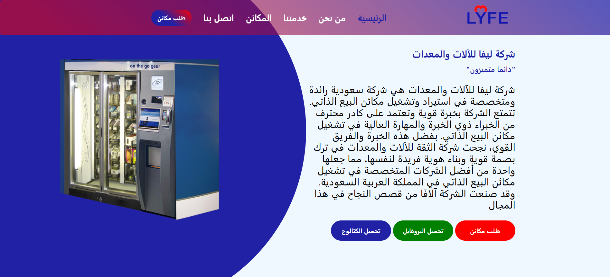
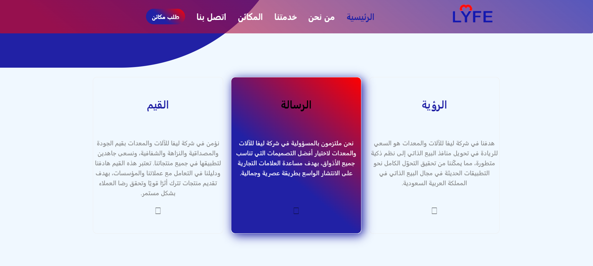
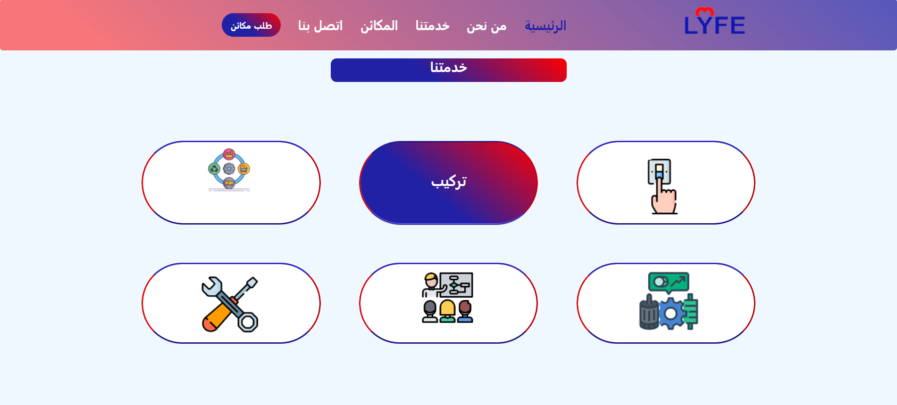

# LYFE Website (Freelance Project)

A modern Arabic (RTL) business landing page built using **Vanilla HTML, CSS, and JavaScript** for a vending machines company.

## 🌐 Overview

This project was developed as a **freelance website** for **LYFE Company**, a Saudi-based business specializing in vending machine solutions.

The goal was to create a clean, professional online presence to showcase the company’s services and strengthen its brand identity.

## 🎯 Project Goals

* Build a modern and responsive company website
* Support **Arabic RTL layout** بالكامل
* Present services and offerings بشكل واضح وجذاب
* Improve user experience and navigation

## ✨ Features

* ✅ Fully responsive design
* ✅ RTL (Right-to-Left) Arabic layout
* ✅ Hero section with company introduction
* ✅ Services showcase (تشغيل، تركيب، توريد، صيانة...)
* ✅ “Why Choose Us” section
* ✅ Partners slideshow
* ✅ Contact form UI
* ✅ Mobile-friendly navigation menu

## 🛠️ Tech Stack

* HTML5
* CSS3 (Custom + Normalize.css)
* Vanilla JavaScript
* Font Awesome

## 📁 Project Structure

```
LYFE/
│── index.html
│── css/
│   ├── style.css
│   ├── normalize.css
│   └── all.min.css
│── javaScript/
│   └── app.js
│── images/
```

## 🚀 Getting Started

```bash
git clone https://github.com/your-username/lyfe-website.git
cd lyfe-website
```

Then open `index.html` in your browser.

## 📌 Notes

* This project was delivered as a **frontend-only freelance solution**
* The contact form is currently UI-only (no backend integration)
* Assets (images/content) were provided/used for demonstration

## 💼 Freelance Context

* 👤 Role: Frontend Developer
* 🧩 Scope: UI/UX implementation + responsive design
* 🛠️ Responsibility: Full frontend development from scratch

## 📸 Preview





## 👨‍💻 Author

Developed by **Abdelrahman Youssef**

---

⭐ If you found this project helpful, feel free to star the repo!
